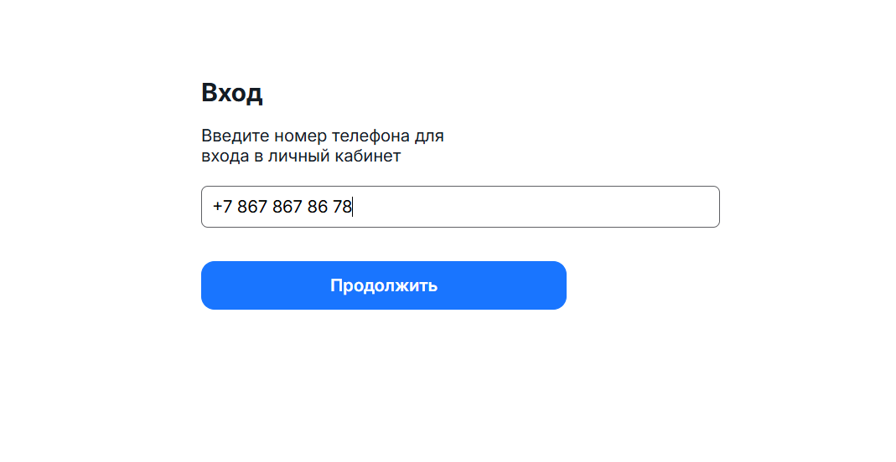

# 📱 Форма авторизации по номеру телефона и OTP-коду

Веб-приложение для авторизации пользователей через номер телефона и одноразовый пароль (OTP).  
Реализована двухэтапная аутентификация: ввод номера → получение OTP → ввод кода → вход.  
Поддерживается таймер обратного отсчёта и повторная отправка кода.




---

## 🚀 Технологии

- React 18
- Vite
- TS
- React Router
- Scss

---

## ⚙️ Установка и запуск

1. Клонируйте репозиторий и перейдите в папку Notes:
   ```bash
   git clone https://github.com/IvanT00/Phone-auth-form.git
   cd Phone-auth-form
2. Установите зависимости:
   ```bash
   npm install
3. Запустите приложение в режиме разработки
   ```bash
   npm run dev